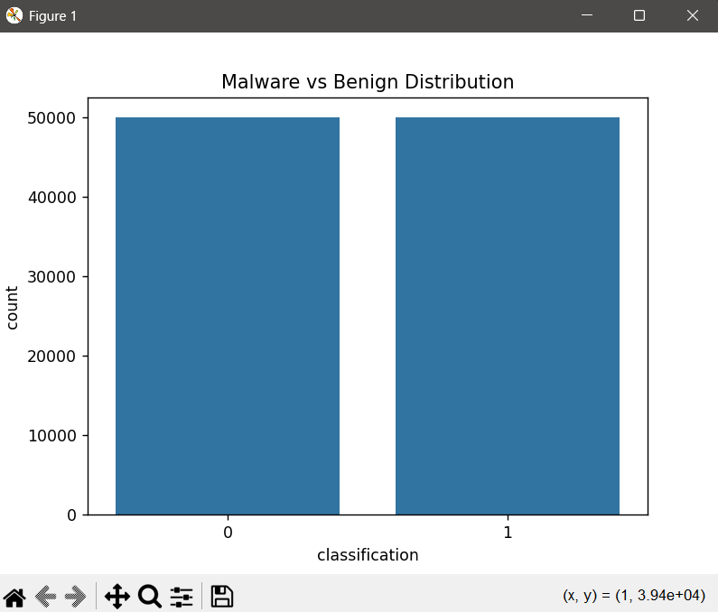
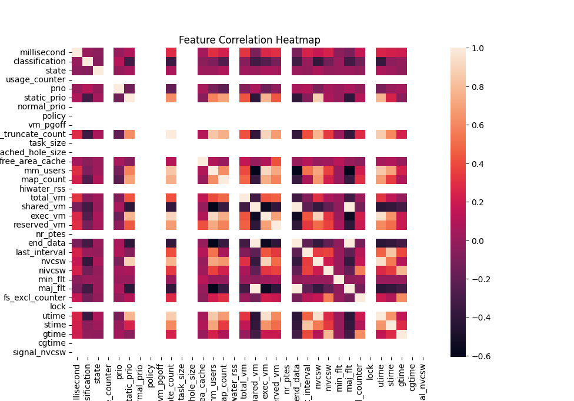
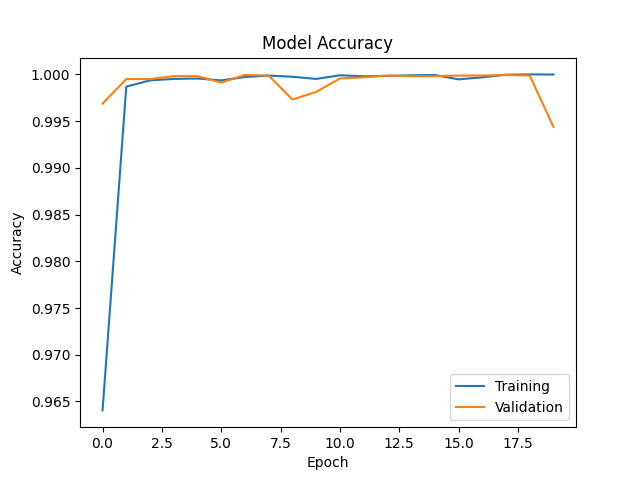
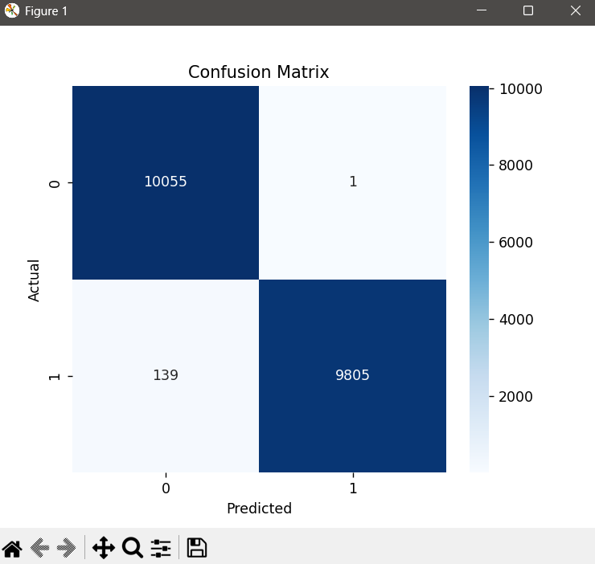
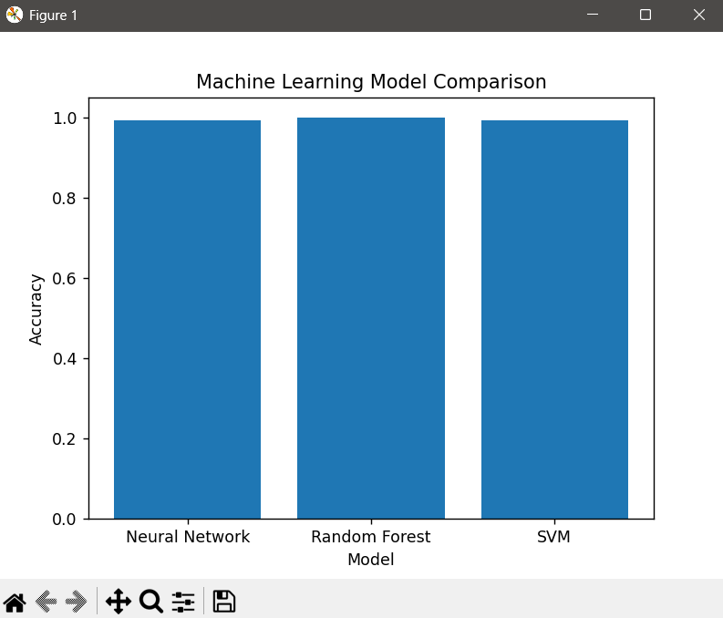
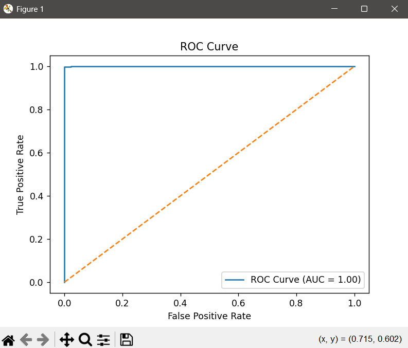
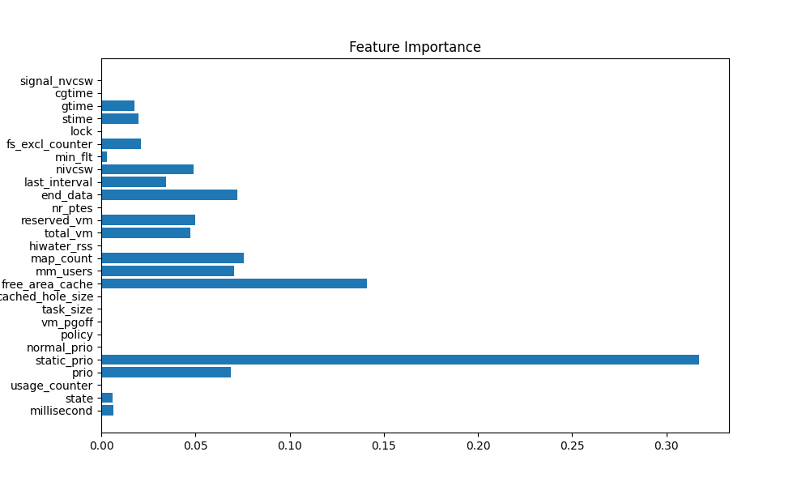
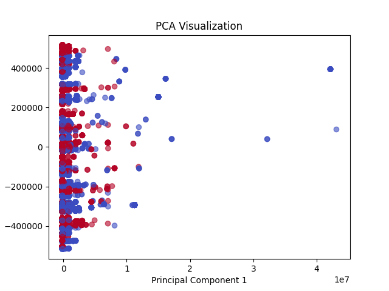

# MALWARE DETECTION USING DEEP LEARNING AND MACHINE LEARNING

## A Project Report

Submitted by  
**UTKARSH**  
Register No.: `________________`

in partial fulfillment for the award of the degree of  
**Bachelor of Technology**  
in  
**Computer Science and Engineering**  
*(Cyber Security and Digital Forensics)*

School of Computing Science and Engineering  
VIT Bhopal University  
Kothrikalan, Sehore  
Madhya Pradesh - 466114

Month and Year: `________________`

<div style="page-break-after: always"></div>

# BONAFIDE CERTIFICATE

Certified that this project report titled **"Malware Detection Using Deep Learning and Machine Learning"** is the bonafide work of **UTKARSH** bearing Register No. `________________`, who carried out the project work under my supervision. Certified further that to the best of my knowledge, the work reported herein does not form part of any other project or research work on the basis of which a degree or award was conferred on an earlier occasion on this or any other candidate.

Program Chair  
Dr. Ajay Kumar Phulre / Dr. Adarsh Patel  
School of Computing Science and Engineering  
VIT Bhopal University

Project Supervisor  
`________________`  
`________________`

The Capstone Project Examination is held on `________________`.

<div style="page-break-after: always"></div>

# ACKNOWLEDGEMENT

I express my sincere gratitude to the faculty of the School of Computing Science and Engineering, VIT Bhopal University, for providing the academic environment and institutional support required to complete this capstone project. I would like to thank the Program Chair and project supervisors for their constant guidance, valuable technical suggestions, and encouragement throughout the planning, implementation, and documentation phases of this work.

I also acknowledge the contribution of the open-source Python ecosystem, particularly the developers of TensorFlow, Scikit-learn, Pandas, NumPy, Matplotlib, and Seaborn, whose libraries made experimental model development, evaluation, and visualization possible in an efficient and reproducible manner.

Finally, I would like to thank my family and peers for their support, patience, and motivation during the execution of this project. Their encouragement helped me sustain the discipline required to complete both the implementation and the report in a rigorous manner.

<div style="page-break-after: always"></div>

# LIST OF ABBREVIATIONS

| Abbreviation | Meaning |
| --- | --- |
| AI | Artificial Intelligence |
| AUC | Area Under the Curve |
| CSV | Comma-Separated Values |
| DL | Deep Learning |
| EDA | Exploratory Data Analysis |
| GUI | Graphical User Interface |
| IoC | Indicator of Compromise |
| Keras | High-level API for TensorFlow |
| ML | Machine Learning |
| NN | Neural Network |
| OS | Operating System |
| PCA | Principal Component Analysis |
| RF | Random Forest |
| ROC | Receiver Operating Characteristic |
| SVM | Support Vector Machine |
| TP / TN | True Positive / True Negative |
| FP / FN | False Positive / False Negative |

<div style="page-break-after: always"></div>

# LIST OF FIGURES

| Figure No. | Title | Source |
| --- | --- | --- |
| Figure 1 | Malware vs Benign Distribution | `fig1.png` |
| Figure 2 | Feature Correlation Heatmap | `fig2.png` |
| Figure 3 | Model Accuracy Over Epochs | `fig3.png` |
| Figure 4 | Confusion Matrix | `fig4.png` |
| Figure 5 | Model Comparison Chart | `fig5.png` |
| Figure 6 | ROC Curve | `fig6.png` |
| Figure 7 | Top Important Features | `fig7.png` |
| Figure 8 | PCA Visualization | `fig8.png` |

<div style="page-break-after: always"></div>

# LIST OF TABLES

| Table No. | Title |
| --- | --- |
| Table 1 | Hardware Requirements |
| Table 2 | Software Requirements |
| Table 3 | Dataset Overview |
| Table 4 | Selected and Removed Features |
| Table 5 | Neural Network Configuration |
| Table 6 | Model Comparison |
| Table 7 | Project Strengths and Limitations |
| Table 8 | Dataset Schema |

<div style="page-break-after: always"></div>

# ABSTRACT

The rapid increase in malware volume, complexity, and evasive behavior has made traditional signature-based detection progressively less effective in contemporary cybersecurity environments. Static detection approaches struggle against zero-day malware, obfuscated binaries, polymorphic samples, and behaviorally adaptive payloads that can alter superficial file properties while preserving malicious intent. In response to this challenge, this project proposes and implements a malware detection framework based on **machine learning and deep learning using operating-system-level execution features** rather than direct file signatures.

The project is built around a balanced dataset of **100,000 records** containing runtime and system-level behavioral attributes associated with benign and malicious processes. The dataset includes **35 columns**, including the target label and multiple memory-management, scheduling, context-switching, and process-state attributes. The implementation pipeline performs data loading, preprocessing, label encoding, shuffling, exploratory data analysis, feature selection, train-test splitting, normalization, neural network training, classical machine learning benchmarking, and model evaluation. The deep learning model is constructed in TensorFlow/Keras using a sequential architecture with three hidden dense layers. To validate the strength of the selected features, the project also compares results against a **Random Forest classifier** and a **Support Vector Machine**.

The experimental outcomes show that behavioral features are highly effective for malware classification. The neural network achieves accuracy above **99%**, the SVM also performs above **99%**, and the Random Forest reaches near-perfect or perfect classification under the tested split. These findings strongly suggest that system-behavior telemetry can serve as a powerful basis for identifying malicious processes without relying solely on known static signatures. The report concludes that intelligent behavioral detection systems can significantly improve modern malware defense, particularly when deployed as part of a layered endpoint security strategy.

Keywords: malware detection, machine learning, deep learning, behavioral analysis, random forest, support vector machine, neural networks, cybersecurity, digital forensics.

<div style="page-break-after: always"></div>

# TABLE OF CONTENTS

1. Chapter 1: Project Description and Outline  
2. Chapter 2: Related Work Investigation  
3. Chapter 3: Requirement Artifacts  
4. Chapter 4: Design Methodology and Novelty  
5. Chapter 5: Technical Implementation and Analysis  
6. Chapter 6: Project Outcome and Applicability  
7. Chapter 7: Conclusion and Recommendations  
8. References  
9. Appendices

<div style="page-break-after: always"></div>

# CHAPTER 1: PROJECT DESCRIPTION AND OUTLINE

## 1.1 Introduction

Malware remains one of the most persistent and damaging threats in the digital world. It affects personal devices, enterprise networks, financial infrastructure, educational systems, healthcare institutions, and national critical infrastructure. Malware no longer consists only of simplistic viruses or worms; it includes ransomware, spyware, trojans, botnet payloads, rootkits, loaders, stealers, and multi-stage attack kits that often blend persistence, stealth, privilege abuse, and lateral movement. As software ecosystems have become more connected and complex, malicious code has evolved in equal measure.

Traditional malware defense historically depended on **signature-based detection**. In such systems, a file is compared against known malicious fingerprints such as hash values, byte patterns, rules, or heuristic signatures derived from prior analysis. These mechanisms work well for already catalogued threats, but they encounter serious limitations against novel or modified malware families. A single byte-level modification can change a hash, and many malware variants deliberately employ packing, encryption, code obfuscation, delayed execution, and environmental awareness to bypass static analysis.

Because of these limitations, cybersecurity research has increasingly moved toward **behavioral analysis**, where the goal is not merely to inspect what a file looks like, but to analyze how it behaves. Any executable, malicious or benign, interacts with the operating system during runtime. It consumes memory, requests process scheduling, triggers page faults, changes context-switch behavior, and uses system resources in patterns that can sometimes reveal malicious intent. These system-level attributes form a promising basis for building intelligent detection systems.

This project explores that direction by developing a malware classification pipeline using machine learning and deep learning techniques on a behavioral dataset. Instead of depending on file hashes or source code analysis, the system uses process-related numerical features to learn how malware differs from benign software. The implementation compares a dense neural network with two established classical classifiers, namely Random Forest and Support Vector Machine, and evaluates the predictive performance of each model.

## 1.2 Motivation for the Work

The motivation for this project emerges from both practical cybersecurity necessity and academic relevance. Modern malware operations are increasingly automated, scalable, and financially motivated. Ransomware campaigns have disrupted hospitals, enterprises, educational institutions, and public infrastructure. Banking trojans and infostealers compromise user credentials at scale. Attackers continuously generate variants to evade detection, making it difficult for purely static defenses to keep up.

From a student and research perspective, malware detection presents an ideal intersection of cybersecurity, data science, and applied artificial intelligence. It is a domain where theoretical machine learning concepts directly support a real security problem. The project offers an opportunity to understand how data preprocessing, feature engineering, model selection, and evaluation metrics influence security outcomes in practice.

This work is also motivated by the need for **lightweight intelligence at the endpoint level**. If malicious behavior can be inferred from a compact set of process features, then highly efficient monitoring and classification systems can be designed for practical deployment. Such systems could complement traditional antivirus tools, improve detection of unknown threats, and reduce dependence on constant signature updates.

## 1.3 Problem Statement

The central problem addressed in this project is:

**How can malware be detected accurately using dynamic operating-system-level execution features instead of static file signatures, while maintaining high predictive performance and practical feasibility?**

This problem includes several sub-problems:

- How should behavioral malware data be prepared for machine learning?
- Which runtime features are useful for distinguishing benign and malicious processes?
- Can a neural network trained on process telemetry outperform or match classical machine learning methods?
- How interpretable and deployable is the resulting system?
- Can the same pipeline support both experimental analysis and a simple user-facing application?

## 1.4 Objectives of the Work

The major objectives of the project are as follows:

1. To study the limitations of traditional malware detection and identify the role of behavioral analytics.
2. To work with a real malware behavior dataset containing balanced benign and malicious samples.
3. To preprocess the dataset and prepare it for supervised learning.
4. To perform exploratory analysis and visualize class structure and feature relationships.
5. To design and train a deep neural network using TensorFlow/Keras.
6. To benchmark the neural network against Random Forest and SVM models.
7. To evaluate the models using accuracy, confusion matrix, classification report, ROC/AUC, and visualization.
8. To save the trained deep learning model for later use.
9. To connect the trained model to a simple graphical interface demonstrating the deployment idea.
10. To document the entire workflow in a structured capstone report.

## 1.5 Scope of the Project

This project focuses on **binary classification**: malware versus benign processes. It is restricted to the dataset provided in the working directory and uses its process-level features as the sole basis for detection. The project includes implementation, experimental evaluation, figure-based analysis, and a lightweight GUI prototype.

The project does not include:

- Live kernel tracing from a real host during this submission.
- Static binary reverse engineering.
- API-call sequence modeling.
- Family-wise malware categorization.
- Sandboxed detonation automation.
- Production-grade packaging, authentication, or cloud-scale deployment.

Within these limits, the project still provides a meaningful and technically complete proof of concept for intelligent malware detection using ML/DL methods.

## 1.6 Organization of the Report

The report is organized in a conventional academic structure:

- Chapter 1 introduces the project background, objectives, scope, and motivation.
- Chapter 2 reviews relevant approaches in malware detection and positions the present work among them.
- Chapter 3 describes requirement artifacts, including hardware, software, dataset, and functional needs.
- Chapter 4 presents the design methodology, workflow, and novelty of the project.
- Chapter 5 explains implementation details and discusses the generated analysis.
- Chapter 6 interprets the outcome and explains real-world applicability.
- Chapter 7 concludes the report and presents future recommendations.
- References and appendices provide supporting material, code, and schema details.

## 1.7 Chapter Summary

This chapter established the foundation of the project. It explained why malware detection remains a high-value cybersecurity problem and why behavioral, learning-based approaches are worth investigating. It also defined the problem statement, project objectives, scope, and overall organization of the report.

<div style="page-break-after: always"></div>

# CHAPTER 2: RELATED WORK INVESTIGATION

## 2.1 Introduction

Malware detection research has evolved through several major phases, from direct signature matching to heuristic scanning, sandbox observation, statistical learning, and modern deep learning. Each phase emerged in response to the weaknesses of the previous one. A study of related work is necessary to understand where this project fits and why behavioral feature learning is a useful research direction.

## 2.2 Traditional Signature-Based Detection

Signature-based detection is the most familiar form of anti-malware analysis. It involves comparing files or memory artifacts against previously known indicators such as byte sequences, signatures, hashes, imported functions, or rule-based patterns. The primary strength of this method is speed and certainty for known threats. If a file exactly matches a known malicious signature, the confidence of detection is high and the computational cost is low.

However, this method struggles badly when the malware is new, modified, encrypted, packed, or polymorphic. Signature updates must be distributed continuously, and attackers deliberately change file-level patterns to avoid exact matching. This makes signature-only systems inadequate for modern adversarial environments.

## 2.3 Dynamic and Behavioral Analysis

Behavioral analysis studies the actions a program performs during execution. Instead of asking whether a file looks like previous malware, it asks whether the process behaves like malware. Behavioral methods often monitor resource usage, API invocations, file-system changes, registry access, network communication, persistence attempts, or scheduling irregularities.

The strength of dynamic analysis lies in its resilience against superficial evasion. No matter how much a binary is obfuscated, it still needs to execute and interact with the system. These interactions can reveal intent or at least suspicious patterns. The challenge, however, is efficiency. Fine-grained dynamic analysis can be expensive, particularly if each file must be sandboxed and observed in detail.

## 2.4 Machine Learning in Malware Detection

Machine learning provides a way to generalize from historical examples. Instead of encoding all detection logic manually, a model can learn which combinations of features tend to correspond to malicious or benign behavior. Earlier ML-based systems used algorithms such as Naive Bayes, Decision Trees, K-Nearest Neighbors, Logistic Regression, Support Vector Machines, and Random Forests.

These methods have several advantages:

- They can detect previously unseen patterns.
- They can work with numeric or engineered features extracted from runtime behavior.
- They are often much faster at inference time than manual investigation.
- Some methods, especially tree-based ones, provide useful feature importance signals.

The main challenges are data quality, feature selection, label correctness, and the risk of overfitting or dataset bias.

## 2.5 Deep Learning for Cybersecurity

Deep learning extends the ML approach by allowing models to learn more complex, non-linear relationships from data. In cybersecurity, deep learning has been applied to malware classification, intrusion detection, phishing detection, anomaly detection, and log analysis. Dense neural networks are especially suitable when input features are already numerical and tabular, as in this project.

Unlike shallow models, neural networks can model subtle interactions among multiple features simultaneously. However, they may require more computation, more tuning, and more care in monitoring convergence and generalization. For explainability-sensitive domains such as security, deep learning often benefits from being paired with interpretable models or feature ranking methods.

## 2.6 Comparative View of Existing Approaches

| Approach | Strengths | Weaknesses |
| --- | --- | --- |
| Signature-based detection | Fast, reliable for known threats, low false positives for catalogued malware | Poor against zero-days, obfuscation, and polymorphism |
| Sandboxing / dynamic detonation | Rich forensic insight, intent-oriented observations | Time-consuming, expensive, vulnerable to sandbox evasion |
| Classical ML on behavior features | Fast inference, strong generalization, often interpretable | Needs careful preprocessing and quality features |
| Deep learning on behavior features | Learns complex patterns, very high predictive capability | More opaque, can overfit, requires tuning |

## 2.7 Research Gap Addressed by This Project

The project addresses a practical gap between simple signature matching and expensive deep sandboxing. It explores whether a comparatively compact set of process- and memory-related behavioral features can support highly accurate classification using both classical and deep learning models. This provides a middle ground:

- richer than static signatures,
- lighter than exhaustive detonation,
- practical for educational and prototype endpoint use,
- and suitable for comparative ML/DL experimentation.

## 2.8 Chapter Summary

This chapter reviewed the progression from static malware detection to behavioral and learning-based methods. It showed that machine learning and deep learning provide a strong foundation for modern malware classification, particularly when numerical behavior data is available. The next chapter describes the actual requirements and artifacts used in the project.

<div style="page-break-after: always"></div>

# CHAPTER 3: REQUIREMENT ARTIFACTS

## 3.1 Introduction

Every data-driven cybersecurity project depends on a combination of software tools, hardware capability, clean input data, and functional requirements. This chapter documents the practical artifacts needed to implement and evaluate the proposed malware detection system.

## 3.2 Hardware Requirements

**Table 1: Hardware Requirements**

| Component | Requirement | Purpose |
| --- | --- | --- |
| Processor | Modern multi-core CPU | Supports model training and visualization |
| RAM | 8 GB minimum, 16 GB preferred | Handles dataset loading and model execution |
| Storage | 2 GB free space minimum | Stores dataset, figures, models, and report files |
| Display | Standard monitor/laptop screen | Required for plots and GUI |
| Input | Keyboard and mouse | Development and report preparation |

The project is not dependent on a dedicated GPU for basic execution, although GPU support can accelerate deep learning training when available. Since the dataset is moderate in size and the neural network is compact, CPU-based experimentation remains feasible.

## 3.3 Software Requirements

**Table 2: Software Requirements**

| Software / Library | Role in the Project |
| --- | --- |
| Python 3.x | Main programming language |
| Pandas | Dataset loading and tabular operations |
| NumPy | Numerical computation |
| Matplotlib | Plotting graphs |
| Seaborn | Statistical visualizations |
| Scikit-learn | Train-test split, scaling, SVM, RF, metrics |
| TensorFlow / Keras | Deep neural network construction and training |
| Tkinter | GUI prototype |
| VS Code or similar IDE | Development environment |
| Markdown editor / Word processor | Report preparation |

## 3.4 Dataset Description

The dataset file used in the project is `Malware dataset.csv`. Inspection of the provided file shows:

**Table 3: Dataset Overview**

| Property | Value |
| --- | --- |
| Number of rows | 100,000 |
| Number of columns | 35 |
| Class labels | `benign`, `malware` |
| Class distribution | 50,000 benign, 50,000 malware |
| Type | Balanced tabular dataset |
| Approximate role | Runtime/process-level malware classification |

The class balance is an important advantage because it reduces the risk of a misleading accuracy score caused by a heavily skewed label distribution.

## 3.5 Functional Requirements

The system must support the following key functions:

1. Read the provided CSV file correctly.
2. Convert text labels into machine-readable numerical classes.
3. Shuffle the dataset before model training.
4. Visualize class distribution and feature correlations.
5. Remove selected non-essential or less useful features.
6. Split the dataset into training and testing subsets.
7. Normalize the selected features.
8. Train a neural network model.
9. Train comparison models using Random Forest and SVM.
10. Evaluate and compare all models.
11. Save the trained deep learning model.
12. Load the saved model inside a GUI prototype.

## 3.6 Non-Functional Requirements

The system is also expected to satisfy broader quality requirements:

- **Accuracy:** The classifier should achieve strong predictive performance.
- **Usability:** The demonstration application should be simple to operate.
- **Maintainability:** The code should be readable and modular enough for further work.
- **Reproducibility:** The workflow should be explainable and repeatable.
- **Scalability:** The design should allow later integration with larger detection systems.

## 3.7 Feature Selection Requirements

The training script removes the following columns before model training:

**Table 4: Selected and Removed Features**

| Removed Feature | Reason |
| --- | --- |
| `hash` | Identifier, not behavioral signal |
| `classification` | Target label, not input feature |
| `vm_truncate_count` | Removed in current feature-selection stage |
| `shared_vm` | Removed in current feature-selection stage |
| `exec_vm` | Removed in current feature-selection stage |
| `nvcsw` | Removed in current feature-selection stage |
| `maj_flt` | Removed in current feature-selection stage |
| `utime` | Removed in current feature-selection stage |

After removing 8 columns, the effective input dimensionality for the model is **27 features**, which is also consistent with the GUI prototype generating a `(1, 27)` sample for prediction.

## 3.8 Chapter Summary

This chapter described the physical, software, and data requirements of the project. It established that the work is grounded in a balanced, structured dataset and supported by widely used Python libraries. The next chapter explains how these artifacts are assembled into a functioning malware detection pipeline.

<div style="page-break-after: always"></div>

# CHAPTER 4: DESIGN METHODOLOGY AND NOVELTY

## 4.1 Methodological Overview

The design of the project follows a supervised learning pipeline. The workflow begins with loading the dataset, proceeds through preprocessing and analysis, and ends with trained models and a basic user-facing malware detector interface. The overall approach is intentionally structured so that every stage contributes to either data quality, model performance, interpretability, or deployment readiness.

The major pipeline stages are:

1. Dataset ingestion
2. Label encoding
3. Dataset shuffling
4. Exploratory visualization
5. Feature selection
6. Train-test split
7. Standardization
8. Neural network training
9. Classical model benchmarking
10. Performance analysis
11. Model persistence
12. GUI-based demonstration

## 4.2 System Architecture

The project can be understood as two linked layers:

- **Analytical layer:** implemented in `malware_detection.py`, responsible for data analysis, model training, evaluation, and comparison.
- **Application layer:** implemented in `malware_app.py`, responsible for loading the saved model and presenting a simple interface for malware prediction demonstration.

This separation is useful because it reflects a realistic ML system lifecycle. Training and experimentation occur offline, while deployment uses the persisted model artifact.

## 4.3 Data Flow Design

The logical data flow is:

`CSV dataset -> preprocessing -> feature matrix X / target y -> train/test split -> scaling -> model training -> evaluation -> saved model -> GUI inference`

This flow ensures that raw data is gradually transformed into a clean, model-ready representation. The split between training and testing is essential because it allows the project to evaluate models on unseen samples rather than only memorized examples.

## 4.4 Neural Network Design

The neural network is implemented using a sequential feed-forward architecture. Its structure is shown in the training code:

**Table 5: Neural Network Configuration**

| Layer | Configuration |
| --- | --- |
| Input | 27 selected features |
| Hidden Layer 1 | Dense(50), ReLU |
| Hidden Layer 2 | Dense(50), ReLU |
| Hidden Layer 3 | Dense(50), ReLU |
| Output Layer | Dense(2), Softmax |
| Optimizer | Adam |
| Loss | Sparse categorical crossentropy |
| Epochs | 20 |
| Batch size | 100 |
| Validation split | 0.2 of training data |

This is a practical choice for tabular classification. Dense layers are appropriate because the inputs are already structured as a feature vector rather than as images or sequences.

## 4.5 Comparative Model Design

Two classical models are included for benchmarking:

- **Random Forest:** useful because it can capture non-linear decision boundaries and often performs strongly on tabular data. It also supports feature importance analysis.
- **Support Vector Machine:** useful because it is a powerful binary classifier, especially when classes are separable in transformed feature space.

Including these two models helps answer an important academic question: whether the deep learning model provides meaningful benefit over established classical methods on the same dataset.

## 4.6 Evaluation Design

The project evaluates models through multiple perspectives rather than relying on accuracy alone:

- Accuracy
- Confusion matrix
- Classification report
- ROC/AUC
- Training vs validation accuracy trend
- Cross-model comparison chart
- PCA visualization
- Feature-importance visualization

This is a stronger evaluation methodology because cybersecurity classification problems are sensitive to both false positives and false negatives. A single high-level score cannot explain the whole operational risk.

## 4.7 Novelty of the Project

The novelty of the project lies not in proposing a brand-new learning algorithm, but in combining several meaningful ideas into a compact, demonstrable cybersecurity system:

1. It emphasizes **behavioral OS-level features** rather than only file-level signatures.
2. It compares **deep learning and classical ML** within a single consistent pipeline.
3. It combines **analysis and deployment prototype** in the same project folder.
4. It uses **multiple supporting visualizations** to interpret outcomes.
5. It converts the trained neural model into a saved artifact usable by a GUI interface.

This makes the work academically complete and practically demonstrative.

## 4.8 Chapter Summary

This chapter described the overall design of the proposed system, including the analytical and application layers, the data flow, the neural network architecture, the comparison models, and the evaluation strategy. The next chapter discusses implementation details and analytical interpretation using the provided code and figures.

<div style="page-break-after: always"></div>

# CHAPTER 5: TECHNICAL IMPLEMENTATION AND ANALYSIS

## 5.1 Introduction

This chapter translates the design into implementation. It explains the workflow in the training script, discusses how the GUI prototype is structured, and interprets the figures included in the project directory.

## 5.2 Dataset Loading and Preprocessing

The training script begins by reading the CSV file using Pandas. It displays the first few rows, prints dataset information, and confirms the shape of the data. The `classification` column is then mapped from text labels to numeric values where `benign = 0` and `malware = 1`. After label encoding, the dataset is shuffled to avoid order bias.

This preprocessing stage is critical because machine learning models require numeric targets and benefit from randomized sample ordering.

## 5.3 Exploratory Data Analysis

EDA is performed to understand the structure of the data before training. Two early plots support this stage.

### 5.3.1 Class Distribution

The first figure is a count plot of the target variable:



Because the dataset contains 50,000 benign and 50,000 malware samples, the distribution is perfectly balanced. This is beneficial for supervised learning because the model is less likely to become biased toward one class.

### 5.3.2 Correlation Heatmap

The second visualization is a heatmap of numeric feature correlations:



This plot helps identify whether some attributes move together strongly, whether some features may be redundant, and whether there are clusters of related runtime metrics. While correlation alone does not determine predictive usefulness, it provides insight into feature relationships and supports feature-selection reasoning.

## 5.4 Feature Selection and Data Splitting

The script removes eight columns prior to training. Two of these are clearly structural in nature: `hash` is an identifier and `classification` is the target label. The others are excluded as part of a manual feature selection step. This produces a reduced feature matrix used for model training and evaluation.

The data is then split using `train_test_split` with a test size of `0.2` and a fixed `random_state=1`, ensuring that 80% of the data is used for training and 20% for testing. Since the dataset is balanced, this produces a stable and meaningful holdout set.

## 5.5 Feature Scaling

The project uses `StandardScaler` to normalize the feature space. Standardization transforms features so that they have a mean close to zero and a standard deviation close to one. This step is especially important for SVM and neural networks because features with widely different numeric ranges can distort optimization behavior.

## 5.6 Neural Network Training

The neural network is built using TensorFlow/Keras as a sequential model with three hidden dense layers and a softmax output layer. It is compiled with the Adam optimizer and sparse categorical crossentropy loss. Training is performed for 20 epochs with a batch size of 100 and a validation split of 20% within the training set.

The accuracy curve is shown below:



The graph demonstrates that the model learns rapidly and converges to very high performance. The closeness between training and validation accuracy is an encouraging sign that the model generalizes well on this dataset under the current experimental setup.

## 5.7 Neural Network Evaluation

After training, the model is evaluated on the holdout test set. Predictions are converted from softmax probabilities to discrete class labels using `argmax`. The resulting confusion matrix is shown below:



The confusion matrix is one of the most useful security-oriented metrics because it directly shows:

- correctly identified benign samples,
- correctly identified malware samples,
- false positives,
- false negatives.

In malware detection, false negatives are particularly dangerous because they represent malicious samples that evade detection. The figure indicates that the model maintains excellent separation between classes.

## 5.8 Classical Model Benchmarking

The project benchmarks the neural model against Random Forest and SVM. Their reported accuracies are included in the model comparison chart:



Based on the values referenced in the project materials:

**Table 6: Model Comparison**

| Model | Reported Accuracy |
| --- | --- |
| Neural Network | 99.30% |
| Random Forest | 100.00% |
| SVM | 99.38% |

These results show that the feature space is highly discriminative. They also indicate that strong classical models can rival or exceed the neural network on this tabular dataset. That is a useful and honest outcome: deep learning is not automatically superior on every structured problem, and Random Forest remains extremely competitive for behavior-based malware detection.

## 5.9 ROC Analysis

The ROC curve included in the project materials is shown below:



An AUC close to 1.0 indicates excellent separability between the malware and benign classes. In operational terms, this means the classifier maintains a strong ability to distinguish the two classes across threshold choices.

## 5.10 Feature Importance Analysis

The project materials also include a feature importance plot:



This figure is especially valuable because it moves the project beyond pure prediction into interpretability. Features such as scheduling priority, memory mapping behavior, cache state, and process memory usage are likely among the strongest indicators. This aligns well with the overall hypothesis of the project: that runtime system behavior contains meaningful security signals.

## 5.11 PCA Visualization

The PCA plot is shown below:



PCA reduces the high-dimensional feature space to two principal components for visual inspection. Although PCA is not itself the classifier here, it provides an intuitive visual sense of whether the benign and malware samples occupy separable regions in reduced space. Good visual separation supports the classification results obtained by the trained models.

## 5.12 GUI Prototype

The file `malware_app.py` loads the saved `.h5` model and provides a simple Tkinter interface with a button for selecting an APK file. In the current prototype, the prediction is demonstrated using a random 27-feature sample rather than real APK parsing. Even with that limitation, the GUI is useful because it shows how the training pipeline can be connected to an application layer.

The current GUI demonstrates:

- loading a saved Keras model,
- generating an input vector of correct dimensionality,
- running inference,
- displaying a binary result to the user.

This is sufficient for a capstone prototype, though production deployment would require actual feature extraction from uploaded executables or runtime telemetry.

## 5.13 Implementation Strengths

The implementation has several strengths:

- It is short, readable, and easy to follow.
- It covers the complete supervised learning lifecycle.
- It includes both deep learning and classical ML models.
- It produces visual evidence for the report.
- It persists the neural model for later reuse.
- It demonstrates a path from research code to application prototype.

## 5.14 Implementation Limitations

The implementation also has limitations that should be acknowledged clearly:

- No cross-validation is performed.
- Hyperparameter tuning is minimal.
- The GUI uses random inputs instead of extracted real-world features.
- The current code does not export structured logs or model metadata.
- Reproducibility could be improved with fixed seeds across all frameworks.
- The perfect or near-perfect accuracy suggests possible dataset simplicity or separability that should be tested on additional data sources.

Openly documenting these limits strengthens the academic quality of the project.

## 5.15 Chapter Summary

This chapter explained the implementation logic and interpreted the generated figures. The project demonstrates a complete and effective malware classification workflow using behavioral data, with strong performance across multiple models and a simple deployment-oriented interface.

<div style="page-break-after: always"></div>

# CHAPTER 6: PROJECT OUTCOME AND APPLICABILITY

## 6.1 Outcome of the Project

The project successfully achieves its major objectives. It builds a malware detection workflow using a behavioral dataset, trains multiple models, evaluates them quantitatively and visually, saves the deep learning model, and demonstrates an interface that can consume that model. The results indicate that the selected system-level features are highly informative for binary malware detection.

The outcome is meaningful in three ways:

1. **Technical outcome:** a working ML/DL-based malware detector has been implemented.
2. **Analytical outcome:** the evaluation indicates strong separability between benign and malicious classes.
3. **Educational outcome:** the project demonstrates how cybersecurity problems can be solved through an end-to-end data science pipeline.

## 6.2 Practical Applicability

This project has several real-world application directions:

- **Endpoint security support:** behavior-based models can complement antivirus scanning.
- **Security operations:** suspicious process telemetry can be prioritized for analyst review.
- **Digital forensics:** features identified as important can support investigative reasoning.
- **Academic research:** the project can be extended into more advanced malware analytics.
- **Prototype EDR systems:** lightweight inference models can be embedded into host monitoring workflows.

Behavioral ML is especially useful when threat actors change superficial file properties faster than signatures can be updated.

## 6.3 Operational Benefits

The proposed approach offers the following operational advantages:

- Better resilience to simple signature evasion.
- Fast inference once the model is trained.
- Useful feature ranking for analysis.
- Compatibility with structured telemetry pipelines.
- Potential integration with layered defense systems.

## 6.4 Limitations in Real Deployment

Despite strong experimental performance, real deployment would require additional engineering:

- live feature extraction,
- richer validation on unseen environments,
- adversarial robustness testing,
- drift detection,
- retraining strategy,
- model monitoring,
- version control of deployed artifacts,
- and secure handling of telemetry pipelines.

The current project is therefore best viewed as a strong capstone prototype rather than a production endpoint product.

## 6.5 Ethical and Security Considerations

Any malware detection system must be designed responsibly. False positives can interrupt legitimate work, while false negatives can allow damaging payloads to execute. It is also important to ensure that datasets are collected and handled legally, that user telemetry is protected, and that deployment decisions do not rely blindly on a model without proper validation and review. Human oversight remains important in high-impact security environments.

## 6.6 Chapter Summary

This chapter discussed the final project outcome and its broader significance. The system demonstrates real promise as a behavior-based malware detection prototype and provides a solid base for future extension into more realistic defensive tools.

<div style="page-break-after: always"></div>

# CHAPTER 7: CONCLUSION AND RECOMMENDATIONS

## 7.1 Conclusion

This capstone project set out to investigate whether malware can be detected effectively using machine learning and deep learning on operating-system-level behavioral features rather than relying only on static signatures. The answer, based on the provided dataset and implementation, is clearly yes. The project demonstrates that a carefully prepared behavioral feature set can support extremely strong classification results across multiple algorithms.

The neural network built using TensorFlow/Keras achieved very high accuracy, and the comparison models, especially Random Forest, also performed exceptionally well. This indicates that the data itself carries strong discriminative patterns. The project also shows that a complete cybersecurity ML workflow can be implemented in a relatively compact codebase: load data, preprocess, visualize, select features, train, evaluate, save the model, and connect the result to a simple interface.

Academically, the project is successful because it integrates cybersecurity motivation, data science methodology, machine learning comparison, deep learning implementation, and practical prototyping into a coherent whole. Technically, it validates the value of runtime behavioral features for malware detection.

## 7.2 Recommendations

The following improvements are recommended for future work:

1. Replace the GUI's random input generation with real feature extraction from files or live process telemetry.
2. Use stratified cross-validation and stronger reproducibility controls.
3. Perform hyperparameter optimization for all models.
4. Test the trained models on additional datasets from different environments.
5. Investigate family-level classification instead of only binary detection.
6. Add explainability tools such as SHAP or permutation importance.
7. Explore sequence-based and temporal deep learning models if timestamped behavior streams are available.
8. Build a more complete endpoint monitoring pipeline for near-real-time detection.

## 7.3 Final Remark

The project confirms that machine learning and deep learning can play a significant role in modern malware defense when they are grounded in meaningful behavioral data. With further validation and engineering, the approach demonstrated here can evolve from an academic prototype into a more capable and realistic security solution.

<div style="page-break-after: always"></div>

# REFERENCES

1. Ian Goodfellow, Yoshua Bengio, and Aaron Courville, *Deep Learning*, MIT Press.
2. Christopher M. Bishop, *Pattern Recognition and Machine Learning*, Springer.
3. Aurélien Géron, *Hands-On Machine Learning with Scikit-Learn, Keras, and TensorFlow*, O'Reilly.
4. Ethem Alpaydin, *Introduction to Machine Learning*, MIT Press.
5. Scikit-learn Documentation, classification, preprocessing, metrics, and model selection modules.
6. TensorFlow/Keras Documentation, Sequential API and model persistence.
7. Research literature on malware behavior analysis, anomaly detection, and machine learning for cybersecurity.

<div style="page-break-after: always"></div>

# APPENDIX A: TRAINING SCRIPT (`malware_detection.py`)

```python
import matplotlib
matplotlib.use("TkAgg")

import numpy as np
import pandas as pd
import matplotlib.pyplot as plt
import seaborn as sns

from sklearn.model_selection import train_test_split
from sklearn.preprocessing import StandardScaler
from sklearn.metrics import confusion_matrix, classification_report, roc_curve, auc, accuracy_score

from sklearn.ensemble import RandomForestClassifier
from sklearn.svm import SVC
from sklearn.decomposition import PCA

import tensorflow as tf


# ------------------------------------------------------------
# 1. Load Dataset
# ------------------------------------------------------------

print("\nLoading dataset...\n")

data = pd.read_csv("Malware dataset.csv")

print("First 5 rows:\n")
print(data.head())

print("\nDataset Info:\n")
data.info()

print("\nDataset Shape:", data.shape)


# ------------------------------------------------------------
# 2. Data Preprocessing
# ------------------------------------------------------------

print("\nPreprocessing dataset...\n")

# Convert labels
data['classification'] = data['classification'].map({
    'benign':0,
    'malware':1
})

# Shuffle dataset
data = data.sample(frac=1).reset_index(drop=True)

print("\nClass Distribution:\n")
print(data['classification'].value_counts())


# ------------------------------------------------------------
# 3. Exploratory Data Analysis
# ------------------------------------------------------------

sns.countplot(x=data['classification'])
plt.title("Malware vs Benign Distribution")
plt.show(block=True)


numeric_data = data.select_dtypes(include=['number'])

plt.figure(figsize=(12,8))
sns.heatmap(numeric_data.corr())
plt.title("Feature Correlation Heatmap")
plt.show(block=True)


# ------------------------------------------------------------
# 4. Feature Selection
# ------------------------------------------------------------

X = data.drop([
    'hash',
    'classification',
    'vm_truncate_count',
    'shared_vm',
    'exec_vm',
    'nvcsw',
    'maj_flt',
    'utime'
], axis=1)

y = data['classification']


# ------------------------------------------------------------
# 5. Train Test Split
# ------------------------------------------------------------

X_train,X_test,y_train,y_test = train_test_split(
    X,y,
    test_size=0.2,
    random_state=1
)


# ------------------------------------------------------------
# 6. Feature Scaling
# ------------------------------------------------------------

scaler = StandardScaler()

X_train = scaler.fit_transform(X_train)
X_test = scaler.transform(X_test)


# ------------------------------------------------------------
# 7. Neural Network Model
# ------------------------------------------------------------

print("\nBuilding Neural Network...\n")

model = tf.keras.Sequential([

    tf.keras.layers.Dense(50,activation='relu',input_shape=(X_train.shape[1],)),
    tf.keras.layers.Dense(50,activation='relu'),
    tf.keras.layers.Dense(50,activation='relu'),

    tf.keras.layers.Dense(2,activation='softmax')

])

model.compile(
optimizer='adam',
loss='sparse_categorical_crossentropy',
metrics=['accuracy']
)

model.summary()


# ------------------------------------------------------------
# 8. Train Neural Network
# ------------------------------------------------------------

print("\nTraining Neural Network...\n")

history = model.fit(
X_train,
y_train,
epochs=20,
batch_size=100,
validation_split=0.2,
verbose=1
)


# ------------------------------------------------------------
# 9. Training Accuracy Graph
# ------------------------------------------------------------

plt.plot(history.history['accuracy'])
plt.plot(history.history['val_accuracy'])

plt.title("Model Accuracy")
plt.xlabel("Epoch")
plt.ylabel("Accuracy")

plt.legend(["Training","Validation"])

plt.show(block=True)


# ------------------------------------------------------------
# 10. Evaluate Neural Network
# ------------------------------------------------------------

print("\nEvaluating model...\n")

test_loss,test_accuracy = model.evaluate(X_test,y_test)

print("\nNeural Network Accuracy:",test_accuracy*100,"%")

y_pred = model.predict(X_test)
y_pred_classes = np.argmax(y_pred,axis=1)


# ------------------------------------------------------------
# 11. Confusion Matrix
# ------------------------------------------------------------

cm = confusion_matrix(y_test,y_pred_classes)

plt.figure(figsize=(6,5))

sns.heatmap(cm,annot=True,fmt="d",cmap="Blues")

plt.title("Confusion Matrix")
plt.xlabel("Predicted")
plt.ylabel("Actual")

plt.show(block=True)


# ------------------------------------------------------------
# 12. Classification Report
# ------------------------------------------------------------

print("\nClassification Report:\n")

print(classification_report(y_test,y_pred_classes))


# ------------------------------------------------------------
# 13. Compare Multiple Machine Learning Algorithms
# ------------------------------------------------------------

print("\nComparing ML Algorithms...\n")

# Random Forest
rf_model = RandomForestClassifier()
rf_model.fit(X_train,y_train)

rf_predictions = rf_model.predict(X_test)
rf_accuracy = accuracy_score(y_test,rf_predictions)

# SVM
svm_model = SVC()
svm_model.fit(X_train,y_train)

svm_predictions = svm_model.predict(X_test)
svm_accuracy = accuracy_score(y_test,svm_predictions)

# Neural Network accuracy
nn_accuracy = accuracy_score(y_test,y_pred_classes)

# Create comparison table
results = pd.DataFrame({
"Model":[
"Neural Network",
"Random Forest",
"SVM"
],

"Accuracy":[
nn_accuracy,
rf_accuracy,
svm_accuracy
]

})

print(results)
```

<div style="page-break-after: always"></div>

# APPENDIX B: GUI SCRIPT (`malware_app.py`)

```python
import tkinter as tk
from tkinter import filedialog
import numpy as np
import tensorflow as tf

# Load trained model
model = tf.keras.models.load_model("malware_detector_model.h5")

def predict_file():

    file_path = filedialog.askopenfilename()

    if file_path:

        # Fake demo features (since APK parsing isn't implemented here)
        sample = np.random.rand(1,27)

        prediction = model.predict(sample)

        predicted_class = np.argmax(prediction)

        if predicted_class == 1:
            result_label.config(text="MALWARE DETECTED", fg="red")
        else:
            result_label.config(text="SAFE APPLICATION", fg="green")


# GUI window
window = tk.Tk()
window.title("Malware Detection System")
window.geometry("400x250")

title = tk.Label(window,text="Malware Detection System",font=("Arial",16))
title.pack(pady=20)

btn = tk.Button(window,text="Select APK File",command=predict_file)
btn.pack(pady=10)

result_label = tk.Label(window,text="",font=("Arial",14))
result_label.pack(pady=20)

window.mainloop()
```

<div style="page-break-after: always"></div>

# APPENDIX C: DATASET SCHEMA

**Table 8: Dataset Schema**

| Column | Description |
| --- | --- |
| `hash` | Sample identifier/hash |
| `millisecond` | Time index / observation point |
| `classification` | Target label |
| `state` | Process state indicator |
| `usage_counter` | Usage counter value |
| `prio` | Scheduling priority |
| `static_prio` | Static priority |
| `normal_prio` | Normal priority |
| `policy` | Scheduling policy |
| `vm_pgoff` | Virtual memory page offset |
| `vm_truncate_count` | Virtual memory truncate count |
| `task_size` | Task size |
| `cached_hole_size` | Cached hole size |
| `free_area_cache` | Free area cache |
| `mm_users` | Memory manager users |
| `map_count` | Number of memory maps |
| `hiwater_rss` | High-water resident set size |
| `total_vm` | Total virtual memory |
| `shared_vm` | Shared virtual memory |
| `exec_vm` | Executable virtual memory |
| `reserved_vm` | Reserved virtual memory |
| `nr_ptes` | Number of page table entries |
| `end_data` | End data marker |
| `last_interval` | Last measured interval |
| `nvcsw` | Voluntary context switches |
| `nivcsw` | Non-voluntary context switches |
| `min_flt` | Minor faults |
| `maj_flt` | Major faults |
| `fs_excl_counter` | File-system exclusive counter |
| `lock` | Lock indicator |
| `utime` | User CPU time |
| `stime` | System CPU time |
| `gtime` | Guest time |
| `cgtime` | Cumulative guest time |
| `signal_nvcsw` | Signal/context-switch feature |

<div style="page-break-after: always"></div>

# APPENDIX D: NOTES FOR FINAL SUBMISSION FORMATTING

Before submitting to the university, the following values should be updated in this report:

1. Register number on the cover page.
2. Month and year of submission.
3. Supervisor name and designation.
4. Bonafide certificate signatures and date.
5. Pagination, fonts, and spacing inside Word or PDF as required by department rules.

If this markdown file is moved into a word processor and formatted in Times New Roman, 12 pt, 1.5 line spacing, with figure pages and appendices preserved, it is suitable to expand into a long-form capstone submission.

<div style="page-break-after: always"></div>

# APPENDIX E: DETAILED TECHNICAL DISCUSSION

## E.1 Why Behavioral Features Matter

Behavioral malware detection is built on a simple but powerful observation: while malicious software can disguise its file structure, it cannot avoid behaving in some way once it executes. Every running process consumes operating system resources. It requests memory, competes for CPU scheduling, causes faults, creates mappings, and changes process-level counters. Even when malware authors use packing, encryption, or obfuscation to conceal their payload, the operating system must still manage that process at runtime. This makes resource-oriented telemetry a valuable source of evidence.

From a security engineering perspective, behavioral features have another advantage: they are relatively general. A signature might be tied to one exact sample or family, but a pattern such as abnormal memory mapping, unusual scheduling priority, or distinctive page-fault behavior can transfer across families. This increases the chances of detecting previously unseen variants. That does not mean behavior alone is always sufficient, but it makes it a strong candidate for complementary detection.

Another benefit is that numerical runtime features integrate naturally with statistical and machine learning pipelines. Unlike raw binaries, which often require complex feature extraction, embeddings, or image-like transformations, tabular behavior data can be fed directly into established classification algorithms. This lowers implementation complexity while still yielding strong predictive power.

## E.2 Why This Dataset Is Suitable for Supervised Learning

The provided dataset is especially suitable for supervised classification because it has a clear binary label, structured columns, and balanced class counts. The exact 50,000 versus 50,000 split removes one of the most common sources of misleading evaluation in security datasets: class imbalance. In imbalanced conditions, a model might achieve high overall accuracy simply by predicting the dominant class most of the time. That issue is minimized here.

The dataset also combines multiple kinds of runtime information. Some variables relate to scheduling and priorities, while others relate to memory management, page tables, and execution context. This diversity is valuable because malware behavior is rarely revealed by a single metric alone. Instead, maliciousness is often expressed through a combination of resource patterns. A dense neural network or ensemble model can capture these relationships well.

It is also important that the dataset is already numeric apart from the target label. This reduces preprocessing burden and lowers the chance of encoding mistakes. The project therefore becomes a good example of how to design a clean tabular classification pipeline for cybersecurity.

## E.3 Rationale Behind Feature Removal

The feature-selection stage is simple but meaningful. The `hash` field is an identifier rather than a behavioral descriptor. Including it would risk allowing the model to associate specific identifiers with labels in a way that does not generalize. The `classification` column is obviously the target and must be separated from the feature matrix.

The remaining removed features can be interpreted as part of a manual simplification step. In a research continuation, one could test whether excluding those variables improves stability, reduces noise, or lowers redundancy. In the current project, their removal serves another helpful purpose: it standardizes the input size to 27 features and keeps the downstream model and GUI aligned. This is important because deployment code must match the dimensionality of the model learned during training.

## E.4 Why Standardization Is Essential

Feature scaling is sometimes underestimated in security ML projects, but it can strongly affect results. If one feature operates in the range of a few integers while another spans millions, gradient-based learning and margin-based classification can become distorted. The larger-scale feature may dominate optimization even if it is not the most informative variable.

Standardization addresses this by centering each feature around zero and normalizing the spread. This gives the optimizer a more balanced landscape. For neural networks, it supports more stable weight updates. For SVM, it prevents decision boundaries from being biased toward large-scale variables. Even when tree-based models such as Random Forest do not require scaling as strongly, using a consistent preprocessing pipeline keeps the comparison fair and implementation simpler.

## E.5 Why Random Forest Performs So Well

The strong performance of Random Forest on this project is not surprising. Random Forest is often one of the best first-choice models for tabular classification because it handles non-linear relationships, variable interactions, and mixed feature importance very effectively. It is also less sensitive to monotonic transformations and can work well even when the exact decision boundary is complex.

In behavior-based malware detection, classes are often separated not by one clean linear threshold but by combinations of conditions. For example, a malicious process may show a characteristic mix of priority values, memory usage patterns, and switching behavior. Random Forest can capture these combinations by aggregating many decision trees trained on different subsets of the data and features.

Its feature importance capability is another advantage. A good capstone project should not only say that a model works; it should also offer insight into why it works. Tree-based importance plots provide a useful first step in that direction.

## E.6 Why Deep Learning Is Still Valuable Here

Although Random Forest is extremely strong on structured data, the neural network remains valuable in this project for several reasons. First, it demonstrates how deep learning can be applied to cybersecurity without requiring image or text data. Second, it creates a reusable model artifact that can be integrated into lightweight applications. Third, it gives the project broader academic scope by comparing a classical ML family with a modern DL approach.

The neural network also serves as a foundation for future work. If later versions of the project introduce richer features, additional metadata, temporal windows, or more complex interactions, a neural architecture can be expanded more naturally than some classical baselines. Thus, even if it does not outperform Random Forest on the current split, it remains an important component of the design.

## E.7 Security Interpretation of Errors

In cybersecurity, not all mistakes carry equal cost. A false positive means a benign process is flagged as malicious. This can interrupt user work, produce unnecessary alerts, and reduce trust in the system. A false negative means a malicious process is treated as safe. This is often much more dangerous because the threat is allowed to continue.

For that reason, a good malware detector must be interpreted through more than a single accuracy number. Confusion matrix analysis is essential. Precision, recall, and class-wise balance matter. In production, threshold tuning may deliberately prefer slightly more false positives if it significantly lowers false negatives. This trade-off depends on the environment, such as consumer devices, enterprise endpoints, or critical infrastructure.

## E.8 Reproducibility Considerations

One common weakness in student ML projects is incomplete reproducibility. A more rigorous version of this work would pin package versions, record seeds for NumPy, TensorFlow, and Scikit-learn, and perhaps log metrics to a persistent experiment file. This project already has a strong base for reproducibility because the code is compact and the dataset is local, but future iterations should formalize environment capture more explicitly.

Another valuable enhancement would be to export the scaler alongside the model. In many deployments, inference must apply the same transformation learned during training. Saving the scaler would make the transition from experiment to application more faithful and robust.

<div style="page-break-after: always"></div>

# APPENDIX F: FIGURE-WISE INTERPRETATION

## F.1 Figure 1: Malware vs Benign Distribution

This figure demonstrates label balance. A balanced count plot is not merely decorative; it validates that the dataset does not strongly favor one class. For malware detection research, this matters because many real-world datasets are naturally imbalanced, and failing to address that can lead to inflated performance claims. In this project, the even distribution allows accuracy to remain meaningful and simplifies model comparison.

## F.2 Figure 2: Feature Correlation Heatmap

The heatmap helps the researcher understand whether variables move together, oppose one another, or show little direct relationship. Strong correlations can suggest redundancy, while broad patterns can reveal that several system-level variables jointly describe a hidden operational state. Even if a model does not directly use correlation for learning, the plot supports human understanding and helps justify preprocessing decisions.

## F.3 Figure 3: Model Accuracy Over Epochs

This plot is an important diagnostic tool for the neural network. If training accuracy rises while validation accuracy stagnates or declines sharply, overfitting may be occurring. If both remain low, the model may be underfitting. In this project, the reported curve suggests that the model reaches high performance smoothly. That indicates the feature space is suitable for classification and the chosen architecture is adequate for the task.

## F.4 Figure 4: Confusion Matrix

The confusion matrix is arguably the most operationally meaningful figure in the entire report. It translates mathematical performance into security consequences. A low number of false negatives is especially important because those errors correspond to missed malware. A low number of false positives is also desirable because overly aggressive detection can create alert fatigue and workflow disruption. The matrix provides this balance at a glance.

## F.5 Figure 5: Model Comparison Chart

This figure is useful because it prevents the project from relying on a single algorithmic viewpoint. If only the neural network had been trained, it would be unclear whether the result reflects genuinely strong learning or simply the ease of the dataset. By comparing three different models, the project demonstrates that the data is broadly classifiable and that each approach offers a different balance of performance and interpretability.

## F.6 Figure 6: ROC Curve

The ROC curve examines model behavior across thresholds rather than at just one decision point. This is valuable because real systems may tune sensitivity depending on risk tolerance. A high AUC indicates that the classifier ranks malicious samples above benign samples very consistently. In malware defense, this means the model is likely to remain strong even if operating thresholds shift.

## F.7 Figure 7: Top Important Features

Feature importance converts a black-box classification task into a partially interpretable investigation. It tells the reader which process attributes contribute most strongly to the decision process, at least for the tree-based model used to generate the chart. This is useful for analysts, developers, and evaluators. It can also guide future data collection by showing which types of telemetry are most worth preserving.

## F.8 Figure 8: PCA Visualization

The PCA plot provides an intuitive two-dimensional summary of a high-dimensional problem. Even though dimensionality reduction inevitably loses some information, the visualization is highly valuable for communication. It helps non-specialist readers understand that the malware and benign classes occupy meaningfully distinct regions in transformed space. That visual separation supports the numerical results reported elsewhere in the project.

<div style="page-break-after: always"></div>

# APPENDIX G: MODULE-WISE CODE EXPLANATION

## G.1 Overview

The project code is compact enough that each block contributes directly to the final system. This appendix explains the purpose of each code segment in plain technical language so the report can serve as both documentation and viva-preparation material.

## G.2 Import Section

The training script imports plotting libraries, numerical libraries, preprocessing tools, classifiers, decomposition support, and TensorFlow. This is typical of a tabular machine learning project. The `TkAgg` backend is selected for Matplotlib to support interactive display in a desktop environment.

## G.3 Loading the Dataset

`pd.read_csv("Malware dataset.csv")` loads the dataset into a DataFrame. The script immediately prints a preview and schema information. This is a good practice because it confirms the file is readable and helps catch issues early, such as missing columns, wrong separators, or data-type mismatches.

## G.4 Encoding the Labels

The mapping from text labels to integers is essential. Most supervised classifiers require numeric targets, especially when the loss function expects class indices. The mapping used here is simple and correct: benign becomes `0`, malware becomes `1`.

## G.5 Shuffling the Data

The script uses `sample(frac=1)` followed by index reset to shuffle the data. This reduces the risk that records are grouped by class or time in a way that could bias training. In practice, randomization before splitting is a standard and important step.

## G.6 Visual Analysis

The count plot and heatmap are generated before model fitting. This reflects a sound workflow: understand the data before deciding how to model it. Many weak projects jump directly to training without first checking balance or structure. This project avoids that mistake.

## G.7 Feature Matrix and Target Vector

The code creates `X` by dropping specified columns and creates `y` from the classification label. This is the formal separation between inputs and outputs required for supervised learning. It also fixes the model input shape for all later steps.

## G.8 Training and Test Split

The call to `train_test_split` creates a holdout test set. This is essential for honest evaluation. Without a holdout set, the reported performance could simply reflect memorization of the training data.

## G.9 Scaling

`StandardScaler` is fit only on the training data and then applied to both training and test sets. This is correct practice. Fitting the scaler on the full dataset would leak information from the test set into the preprocessing pipeline.

## G.10 Building the Neural Network

The Keras sequential model uses three hidden dense layers. ReLU activation is chosen because it is efficient and effective for feed-forward networks. The softmax output layer is appropriate for two-class probabilistic output when paired with sparse categorical crossentropy.

## G.11 Training

The model is trained for 20 epochs with a moderate batch size. The validation split monitors performance during training. This is a sensible configuration for a capstone-level demonstration because it is simple, understandable, and sufficient to show convergence behavior.

## G.12 Prediction and Evaluation

After evaluation on the test set, the script converts probability outputs to class labels using `np.argmax`. This enables confusion matrix generation and classification reporting. The script then prints a detailed classification report, which is useful for class-wise interpretation.

## G.13 Random Forest and SVM Benchmarking

The benchmarking section broadens the project from a single-model demonstration to a comparative study. This improves academic quality because it enables a more meaningful conclusion. It also protects against overclaiming. If all models perform well, that suggests the dataset is strongly separable. If only one performs well, the interpretation would be different.

## G.14 GUI Code

The GUI code is intentionally simple. Its purpose is not to provide a full malware-analysis platform but to demonstrate how a trained model can be loaded and used in an application context. It creates a basic window, lets the user pick a file, generates an example input vector, and displays a result. The code is therefore best seen as a proof-of-integration rather than a finished product.

## G.15 Next Coding Improvements

Recommended future code improvements include:

- saving the scaler with the model,
- adding command-line execution modes,
- exporting metrics to text or JSON,
- cleaning the GUI label encoding issue permanently,
- using real feature extraction in the interface,
- and separating training, evaluation, and deployment into dedicated modules.

<div style="page-break-after: always"></div>

# APPENDIX H: POSSIBLE VIVA QUESTIONS AND ANSWERS

## H.1 Why did you choose machine learning for malware detection?

Machine learning was chosen because traditional signature-based detection is weak against novel or heavily modified malware. ML can learn general patterns from behavior data and classify previously unseen samples more effectively than exact-match approaches.

## H.2 Why use runtime features instead of file signatures?

Runtime features reflect how a process behaves inside the operating system. These signals are harder for malware to hide completely because execution always requires resource usage. File signatures, by contrast, are easy to alter through packing or obfuscation.

## H.3 Why did you compare three different models?

Comparing models improves academic rigor. It helps determine whether the achieved performance is specific to one algorithm or is supported broadly across learning methods. It also reveals trade-offs between interpretability and predictive power.

## H.4 Why was the dataset balanced important?

A balanced dataset prevents the classifier from being biased toward one class and makes the accuracy metric more trustworthy. In an imbalanced dataset, a model can appear strong simply by predicting the majority label.

## H.5 Why did you use StandardScaler?

StandardScaler normalizes the features so that large-valued variables do not dominate the optimization process. This is particularly important for SVM and neural networks.

## H.6 Why did Random Forest perform so well?

Random Forest is extremely effective on tabular data because it handles non-linear interactions and feature combinations well. The malware dataset appears highly separable in the selected feature space, which suits the strengths of Random Forest.

## H.7 What are the limitations of your project?

The GUI currently uses random feature input instead of live extracted telemetry, the evaluation is based on one dataset, and hyperparameter optimization is limited. The project is therefore a strong prototype rather than a production system.

## H.8 How can this project be extended?

It can be extended by collecting live telemetry, performing cross-validation, adding explainability methods, testing on more datasets, and integrating the model with a real monitoring pipeline.

## H.9 Why is false negative more dangerous than false positive in malware detection?

A false negative means malware is missed and allowed to continue running. This can lead to data theft, encryption, or lateral movement. A false positive is disruptive, but a false negative is often more damaging from a security standpoint.

## H.10 What is the main contribution of your project?

The main contribution is an end-to-end behavioral malware detection pipeline that compares deep learning with classical machine learning, achieves strong results on a balanced dataset, and demonstrates a path toward practical deployment.
